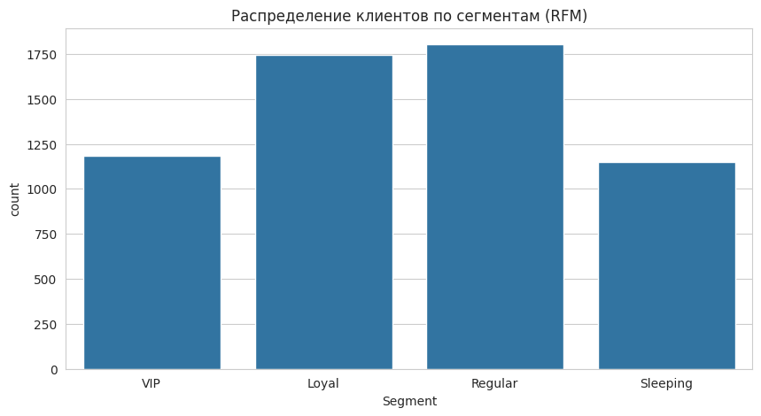
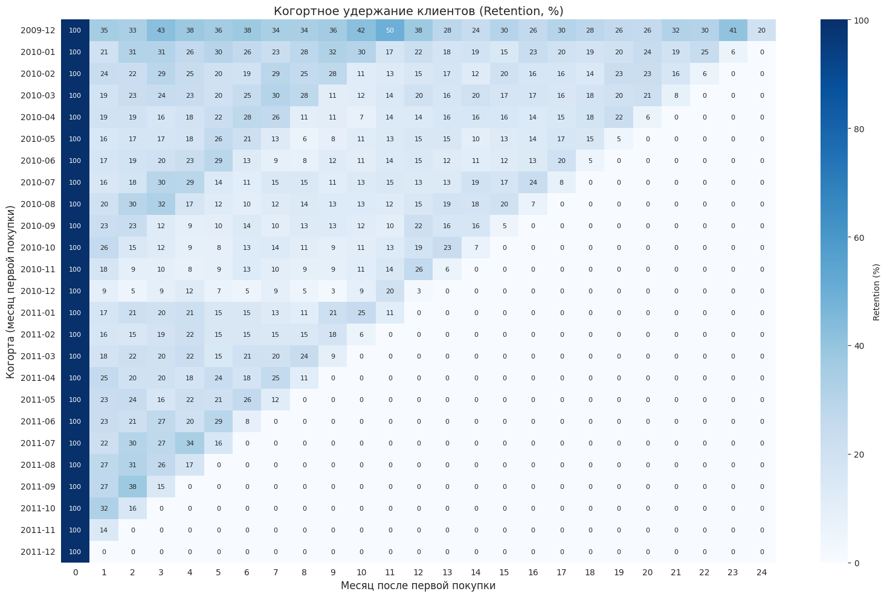
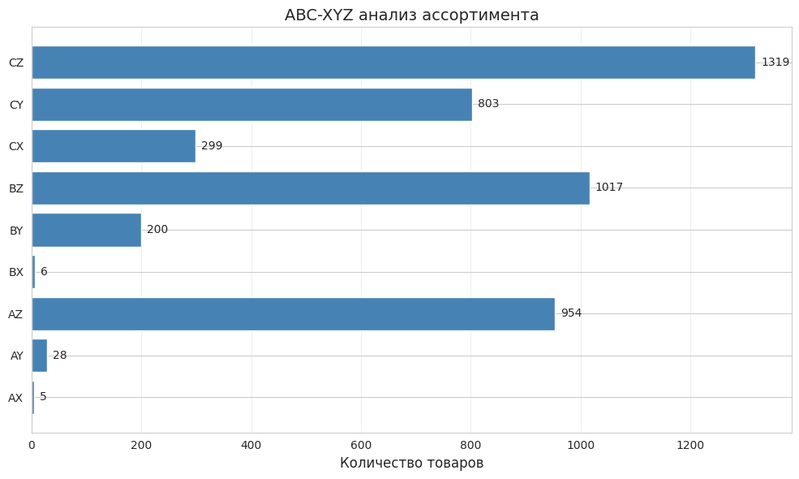

# Online-Retail

# Анализ клиентской базы и ассортимента (RFM + Когорты + ABC-XYZ + Market Basket)

## О проекте
Комплексный анализ 1M+ транзакций интернет-магазина для сегментации клиентов, оценки удержания, оптимизации ассортимента и выявления кросс-продаж.

**Ключевой результат:** VIP-сегмент (20% клиентов) приносит **69% выручки**

## Данные
- Источник: Online Retail Dataset (Kaggle)
- Период: декабрь 2009 – декабрь 2011
- Объём: 805 549 транзакций после очистки
- Уникальных клиентов: 5 878

## Методология

### 1. RFM-сегментация
- **Recency:** дней с последней покупки
- **Frequency:** количество уникальных инвойсов
- **Monetary:** сумма всех покупок
- **Сегменты:** VIP, Loyal, Regular, Sleeping (на основе суммы баллов 3–12)

### 2. Когортный анализ
- Когорты по месяцу первой покупки
- Метрика: Retention (% клиентов, вернувшихся в каждом последующем месяце)

### 3. ABC-XYZ анализ
- **ABC:** вклад в выручку (A: 80%, B: 15%, C: 5%)
- **XYZ:** стабильность спроса (CV: X ≤ 0.5, Y ≤ 1, Z > 1)

### 4. Анализ корзин
- Алгоритм Apriori
- Параметры: min_support = 0.02, min_confidence = 0.3, min_lift = 2

## Результаты

### RFM-сегментация

| Сегмент | Доля клиентов | Доля выручки | 
|---------|---------------|--------------|
| VIP | 20% | **69.3%** |
| Loyal | 30% | 22.3% |
| Regular | 31% | 7.0% |
| Sleeping | 19% | 1.5% |

*Диаграмма распределения клиентов по сегментам:*

### Когортный анализ (Retention)

**Ключевые выводы:**
- Удержание резко падает после 1-го месяца: с 100% до ~24% ко 2-му месяцу
- Когорта декабрь 2010 показывает аномально низкое удержание
- Наблюдается сезонность — больше клиентов возвращается в ноябре

### ABC-XYZ анализ

| Категория | Кол-во товаров | Рекомендация |
|-----------|----------------|--------------|
| AX | 5 | Всегда в наличии, точное прогнозирование |
| AY | 28 | Страховой запас 20-30% |
| AZ | 954 | Страховой запас 40-50% |
| BX | 6 | Управление по факту заказа |
| BY | 200 | Заказ под конкретную потребность |
| BZ | 1,017 | Заказ по факту |
| CX | 299 | Почти не держать на складе |
| CY | 803 | Только под подтверждённый заказ |
| CZ | 1,319 | Исключить из ассортимента |

*Распределение товаров по категориям ABC-XYZ:*

### Анализ корзин

**Найдено 29 ассоциативных правил** со средним Lift = 6.8

| Товар-якорь | Связанные товары | Lift |
|-------------|------------------|------|
| 20725 | 20726 | 7.74 |
| 20725 | 20727 | 7.24 |
| 20725 | 20728 | 7.20 |
| 20725 | 22383 | 6.98 |
| 20725 | 22382 | 6.62 |

## Ключевые выводы

### Клиентская аналитика
- **VIP-сегмент (20% клиентов) генерирует 69% выручки** — приоритет для программ лояльности
- **Sleeping-сегмент (19% клиентов) не покупал более 6 месяцев** — требуется триггерная кампания для реактивации
- **Удержание падает на 2-й месяц до 24%** — критическое окно для вовлечения клиентов

### Ассортиментная оптимизация
- **AX-товары (5 шт.)** — критически важны, требуют строгого контроля запасов
- **CZ-товары (1,319 шт.)** — рекомендуется исключить из ассортимента (низкий вклад + хаотичный спрос)

### Кросс-продажи
- **Товар 20725 — якорный:** его покупка с высокой вероятностью (Lift > 7) ведёт к покупке товаров 20726, 20727, 20728, 22382, 22383
- **Рекомендация:** размещать эти товары вместе на витрине, добавлять в блок «Часто покупают вместе»

## Технологии

Python, pandas, numpy, scikit-learn, matplotlib, seaborn, apyori
